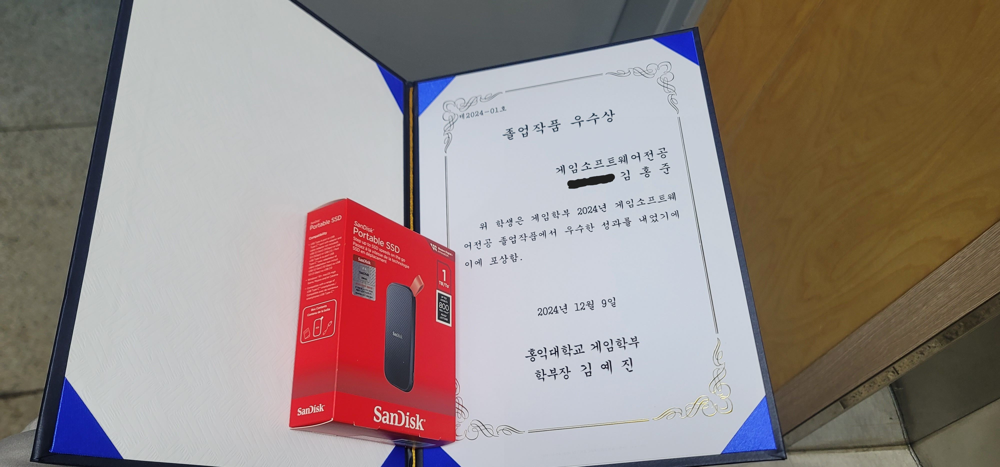

# Duel Players

 | 
---|---|

### 프로젝트 개요

두 명의 플레이어가 대전하여 제한 시간 내 상대의 체력을 최대한 줄이는 것이 목표인 2D형 격투 게임입니다.

스트리트 파이터 / 길티기어 스트라이브 등을 참고하여 Unity로 제작하였습니다.

### 구현 목록

- Input System을 이용하여 패드 및 키보드 입력 시스템을 구현하였습니다.
- (↓ → A)같은 커맨드 입력 판정을 구현하였습니다.
- 프레임별로 플레이어와 적의 상태를 JSON 파일로 저장하여 리플레이 기능을 구현하였습니다.
- Behavior Tree를 이용하여 적 AI 를 구현하였습니다.
- 프레임 정지 시 입력을 기반으로 상태 전이하는 시스템을 구현하였습니다.
- 플레이어의 Idle, 공격, 방어 등의 상태들을 FSM 형태로 구현하였습니다.
- Collider를 이용해 공격 및 피격, 방어 기능을 구현하였습니다.

### 패키지 버전

Unity 2022.3.8f1

Input System 1.6.3 (In Unity)

### 성과

홍익대학교 게임학부에서 주최한 졸업작품 공모전에서  
우수상으로 입상하였습니다.

